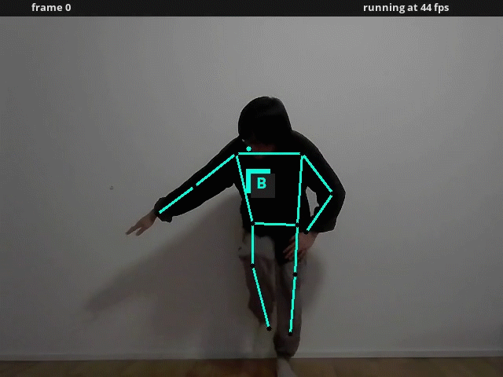

# Real-Time Pose Classification
This a pose tracking and classification pipeline, used in the motion matching project to achieve real-time human pose control.

## Environment
This pipeline is based on fastpose, which only requires few dependencies to be executed (tensorflow, pytorch, opencv, matplotlib and requets) and it's implemented under python 3.6. 

1. The following commands can be used to build the necessary environment in conda :
```
# create the environment
conda create -n fastpose python=3.6

# The both following packages are non-gpu apis
conda install -c conda-forge tensorflow
conda install pytorch torchvision -c pytorch

# older version of opencv can lead to error (version 3.4.2)
conda install opencv

conda install matplotlib

conda install requests
```
2. Download [checkpoints](https://bitbucket.org/hugo_bonnome/fastpose_parameters/downloads/parameters.zip), and unzip the parameters in the project root's folder.

3. Download our customized [pose_dataset](https://drive.google.com/drive/folders/1kRQkHDsmq4glvVc6GE5pZaotsPXpUqiD), and put it under the project root's folder.

4. Make sure you have a camera on your local device.

Now we can start to run:
```
cd ./pose-classifier-on-fastpose
conda activate fastpose
python demo_2d.py
```


## Dataset
We designed 13 different poses to control character movement. For each pose, we record a 1min video and compute the joint positions(13x2, with 13 joints in total) on 2d image. Then, potition data of each frame are stored in list and exported as pickle files. 

Here, we provide examples on performing specific poses to achieve control:
1. Walk

| Walk Forward           |  Walk Leftward           |  Walk Rightward  |
| :------------------: |:------------------: |:------------------: |
|  |   |  |

1. Run

| Run Forward           |  Run Leftward           |  Run Rightward  |
| :------------------: |:------------------: |:------------------: |
|  |   |  |

3. Creep

| Creep Forward           |  Creep Leftward           |  Creep Rightward  |
| :------------------: |:------------------: |:------------------: |
|  |   |  |

4. Other behavior

| Stand Still           |  Jump           |  Dance  |
| :------------------: |:------------------: |:------------------: |
|  |   |  |

## Details on Classifier
This pipeline uses KNN in ```knn.py``` as classifier. We also tried learning based classifier in ```mlp.py```, which is under-developed.

